本台看电影还是少了，很多知名经典影片都没看过  
找时间得补补课

---

这两天来西安，路上随便看了一个贾冰的新片子  
**《奇遇》**
这是今年看的屈指可数的电影之一  
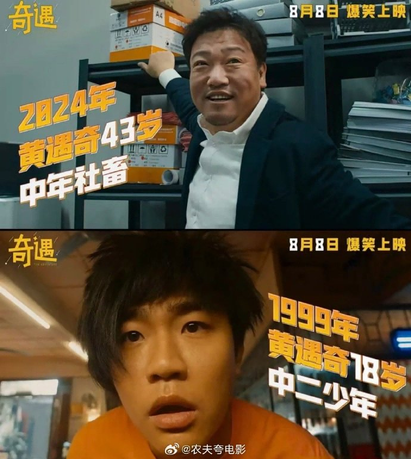

穿越题材  
现在穿越剧应该很火，恐怕跟大家在现实生活中  
承受压力较大有关  
都想换一个人生剧本  
这个电影在穿越上有创新  
18岁的贾冰和43岁的贾冰  
对穿  
电影那叫一个闹腾  
新片子不能不看，因为要与时俱进  
但看了真是感觉没劲，浪费时间

---

上来就跑题了  
韩国电影里，本台最喜欢的是  
《太极旗飘扬》  
影片开始是一个幸福的、充满希望的家庭

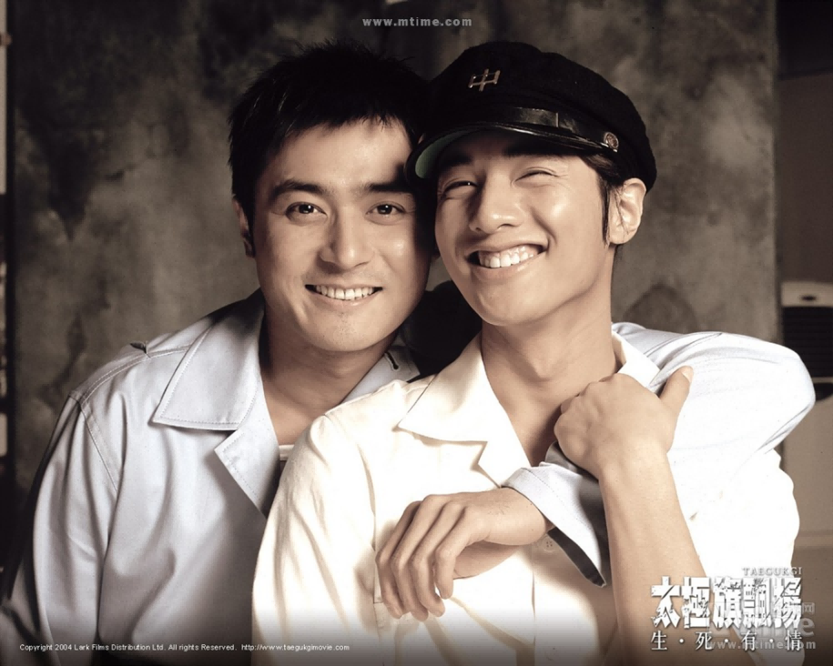

因为大国的斗争，一切都失去了  
振泰在战场上高喊为了家人并杀红了眼  
振硕在尸体堆中质问家人和国家哪个更重要  
这种撕裂感至今难忘

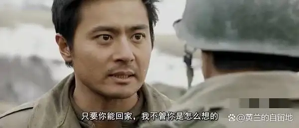

---

这两天看到金建希的新闻，感觉同样有些撕裂  
韩联社报道  
独检组3日在庭上请求法院  
对涉嫌操纵股价和收受贿赂的金建希  
判处有期徒刑15年，罚金20亿韩元

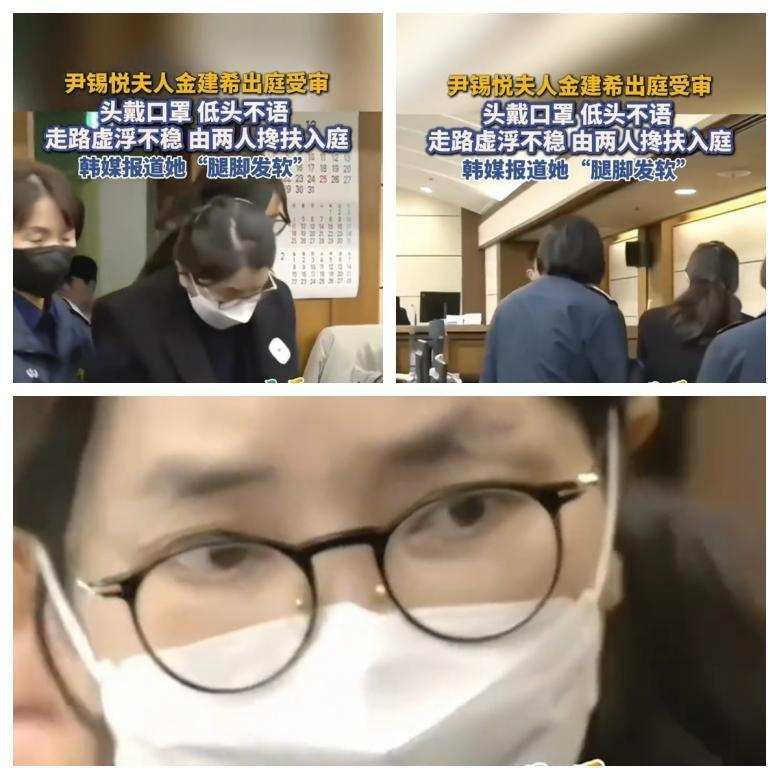

之前的金建希不是这样  
而是

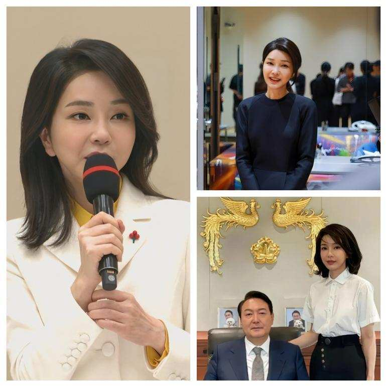

很难想到，这么快就形同两人

---

报道介绍，金建希涉嫌参与操纵宝马汽车  
在韩经销商股价，非法获利约8.1亿韩元  
并于25年8月29日被正式起诉  
金建希还涉嫌与尹锡悦一起在之前大选期间  
从政治掮客明泰均处无偿接受58次民意调查服务  
涉案价值约2.7亿韩元

---

插播一下，什么是政治掮客？什么是政治骗子？  
老虎是大佬，狐狸是老虎的小弟  
狐狸帮其他小动物办事，结果办出事了  
如果老虎也跟着出事  
狐狸就是政治掮客  
如果老虎没出事，稳如泰山  
狐狸就是政治骗子

---

好，我们看尹锡悦  
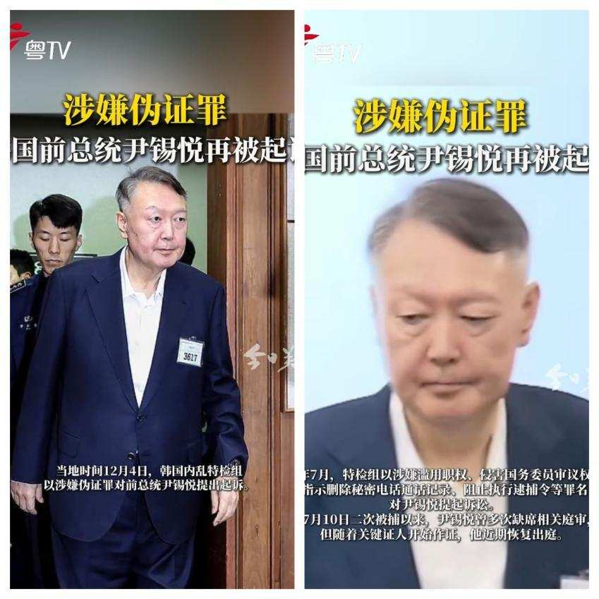

在被控一般利敌罪和滥用职权妨碍权力行使罪后  
韩国前总统尹锡悦又被追加新罪名  
韩联社称，韩国负责调查内乱叛国案的特检组  
4日以涉嫌做伪证为由，再次对尹锡悦提起公诉  
特检组检察官4日在记者会上表示  
尹锡悦涉嫌上月以证人身份出席  
前国务总理韩德洙涉嫌协助内乱头目案庭审做伪证  
7月，特检组以涉嫌

- 滥用职权
- 侵害国务委员审议权
- 指示删除秘密电话通话记录
- 阻止执行逮捕令等罪名

对尹锡悦提起诉讼  
11月10日特检组以涉嫌  
一般利敌罪和滥用职权妨碍权力行使罪  
提出追加起诉

---

我们先来简单回顾  
24年12月3日  
尹锡悦在深夜发表电视讲话宣布实施紧急戒严  
称此举是为了应对***国家陷入瘫痪***的危机  
包括在野党***滥用弹劾权***  
司法系统***非法行为***以及朝鲜渗透威胁等

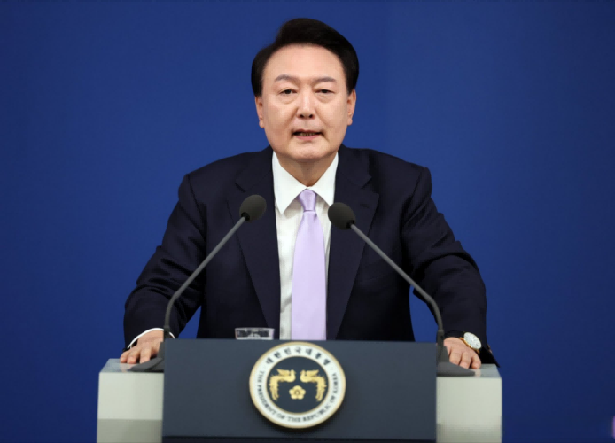

这一讲话引发韩国国内大规模抗议和国际社会谴责  
国会迅速通过决议要求解除戒严  
最终戒严令在数小时内被撤销‌  
宛如一场荒诞幻梦

---

对尹锡悦，这是清算的开始  
虽已无连任可能，但其总统任期尚有两年  
为何此时自断后路？

首先，尹锡悦作为22年总统大选的黑马  
他并无深厚政治资本  
尹锡悦唯一能称道的是反文在寅  
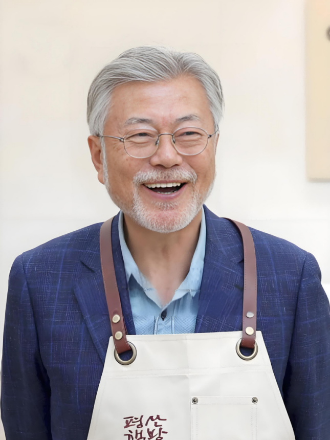

他曾是文在寅提拔的检察长  
却在文在寅推动司法改革时公开跳反辞职  
树立不畏强权形象

说的再通俗一些  
文在寅和司法系统的尹锡悦结成政治同盟  
利用尹锡悦扳倒了朴槿惠  
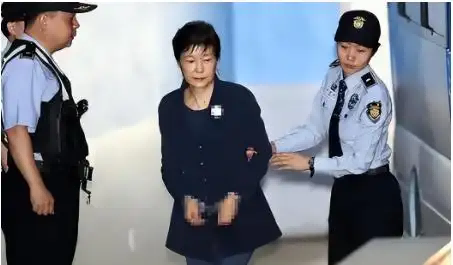

然后文在寅想卸磨杀驴，从尹锡悦入手改革司法系统  
这直接逼反了尹锡悦  
尹锡悦参加大选，高举反文在寅旗帜  
以微弱优势击败李在明  
并让文在寅差点满盘皆输

---

竞选期间，妻子金建希及其背后的财阀网络  
为其造势出力  
财阀投资自然图回报，金建希幕后参政渐成常态  
但金建希及其亲友团违法传闻不断  
每次危机均靠尹锡悦动用总统否决权压住  
却也让其正义检察官人设彻底崩塌

---

同时叠加尹锡悦政府无底线亲日媚日  
引发民族情绪反弹  
外交失策得罪中国致经济受损等因素  
民众不满彻底爆发  
24年7月其所在的国民力量党  
推选韩东勋为新党首，释放弃尹信号  
11月曾被视为尹锡悦亲信力量的韩国警察厅倒戈  
扣押搜查国民力量党总部  
另外，其所在的国民力量党在24年国会选举中惨败

---

特别是，**尹锡悦站的是拜登那一队**  
懂王当选后尹锡悦就各种想办法见懂王  
但懂王根本不给机会  
这一拒绝，释放了明显的信号  
尹锡悦，被放弃已成必然  
这是典型的美国大选神仙打架，尹锡悦凡人遭殃  
只是拒绝了奴才过来磕头，其他奴才便心领神会

---

按常规政治剧本，尹锡悦本应熬完剩余任期  
卸任后再遭清算，重蹈青瓦台诅咒覆辙  
但他显然不甘心

---

尹锡悦的疯狂超乎想象  
12月3日深夜，尹锡悦突然宣布紧急戒严  
随即下令封锁国会，试图阻止反对决议通过

在野党领袖李在明第一时间指控戒严令违宪  
国民力量党新党首韩东勋同步表态这是严重错误  
民众涌上街头高呼逮捕尹锡悦  
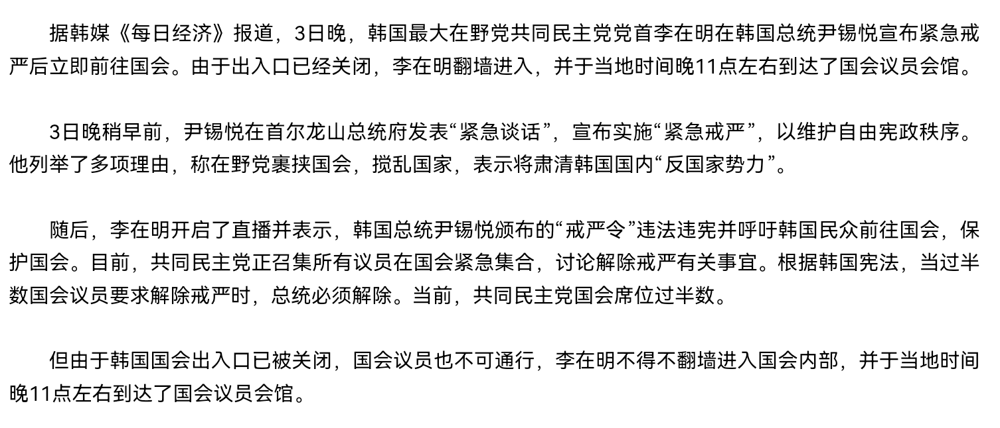

更讽刺的是，执行戒严的军警态度敷衍  
负责封锁国会的特种兵竟拦不住  
已经60岁且年初遇刺重伤的李在明  
他甚至一边开直播一边翻墙进入国会  

戒严令生效仅2小时，国会便全票通过解除戒严决议  
孤立无援的尹锡悦仅坚持4小时便认输  
宣布接受决议、解除戒严  
这场为保权力、留后路的疯狂赌博彻底失败

---

回顾基本结束  
我们还要关注其中几个细节  
一个细节是  
11月10日韩国特检组指控其在总统任期内  
曾伙同军方滥用职权  
试图诱使朝鲜主动进攻韩国  
如果开战了，尹锡悦就不会下台

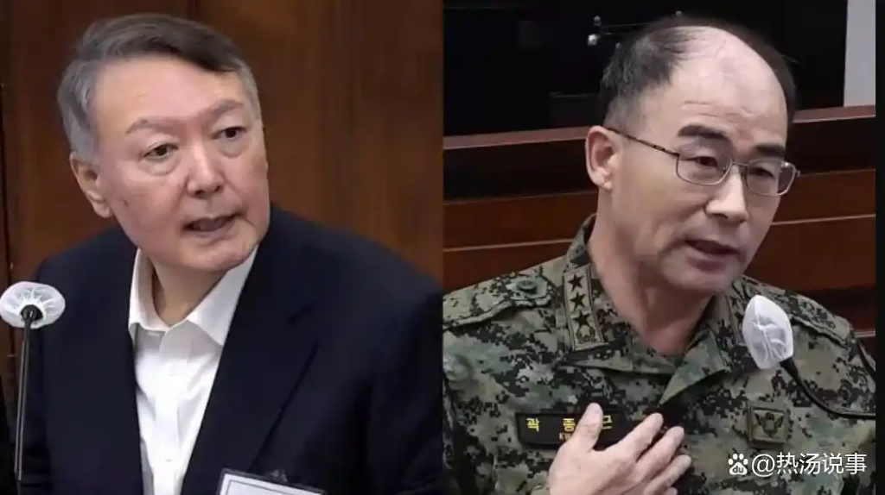

大家不觉得这事大了吗？  
一旦得逞，我们现在恐怕已经被拖进战争  
好在，三胖没有硬刚  
而是得高人指点  
主动炸毁朝韩之间关键交通道路  
此举不仅避免了直接战争  
同时封锁了韩国可能发起的地面进攻路线  
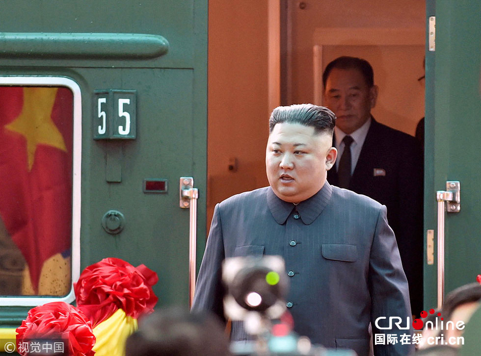

第二个细节是和李在明有关  
23年6月李在明与中国驻韩大使邢海明  
烩面、烩面、烩面  
烩面之后不久  
李在明开始绝食抗议，烩面管事顶饱‌  
 当时在会谈中，大使表示：  
那些赌中国输美国赢的人，一定会后悔

---

请大家注意，这种会面不是随便安排的  
大使不是观音菩萨  
面对山穷水尽的李在明  
既然想谈合作  
就一定要送投名状，然后双方握手  
想学朴槿惠先亲后反，是没有机会了

---

24年1月2日上午，李在明在韩国釜山遇袭  
大难不死‌  
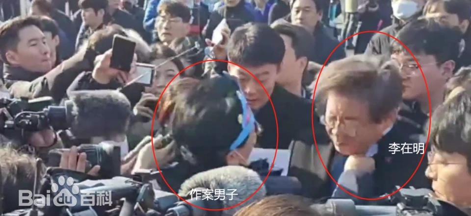

之后，李在明身边就多了一群如影随形的保镖  
正是这些保镖，在戒严当晚  
敢于和部队对峙，保护李在明  
并给李在明争取了跑路翻墙进国会的宝贵时间  
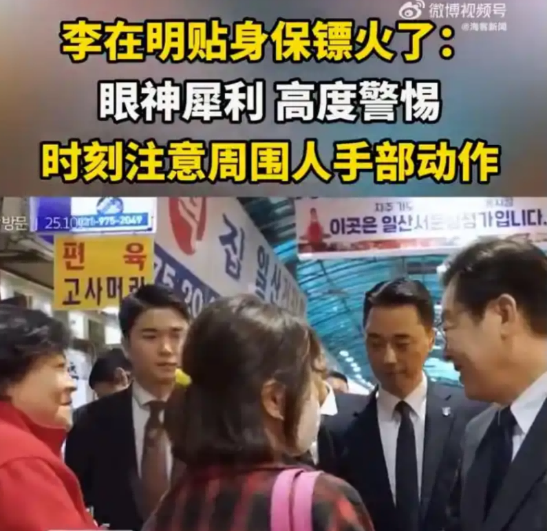

当保镖是为了赚钱，和军队对峙  
不怕既没有抱得美人归，赚了钱还没死花吗  

**所以这些保镖  
身份成疑  
不排除是某方为保护李在明而安排的特工  
某方，本台认为朝鲜没这个能力**

---

李在明登场动作好多  
一是**清算军队高官**  
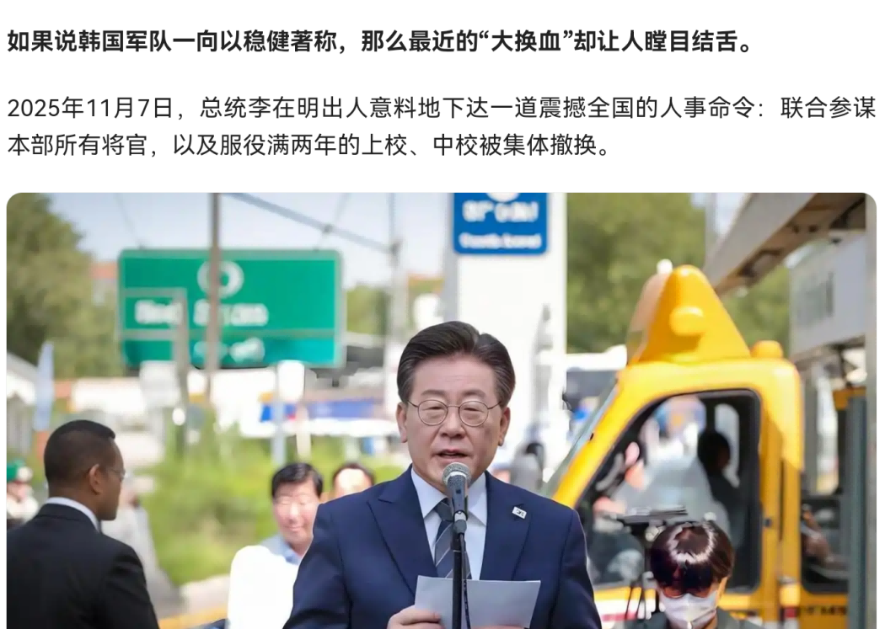

二是**废除检察厅**  
新设立公诉厅和重大犯罪调查厅  
分离检察厅起诉和调查功能  
公诉厅隶属于法务部  
重大犯罪调查厅隶属于行政安全部  
这会防止出现下一个尹锡悦

对于中美，李在明肯定会骑墙  
因为内部美方力量很强，他需要时间  
但内心里，特别是关键问题上  
他还是有所表示的，比如：  
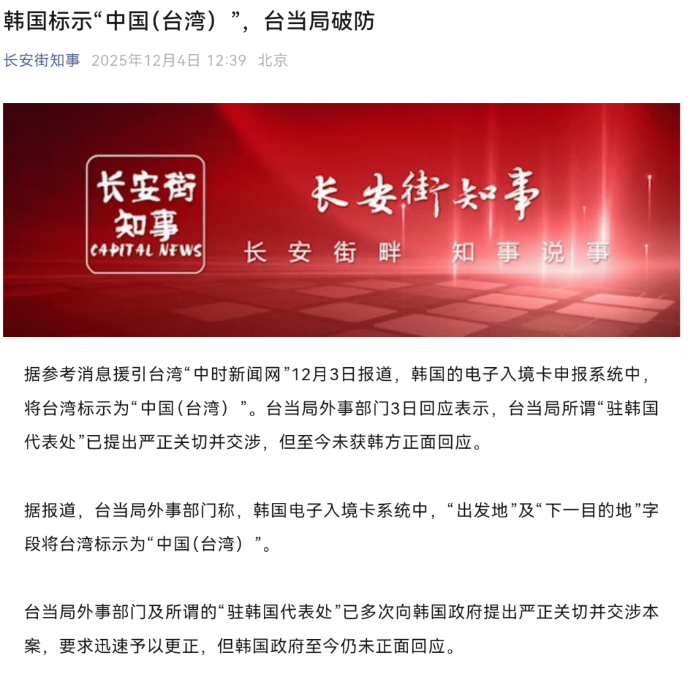

写到这里，还是想说：  
**大国治理主要看内政  
小国治理主要看外交**  
其实没有谁是容易的  
生活不易，工作不易  
如果有穿越的机会，真是想感受一下新的剧本  
但没机会  
所以要**珍惜每一天、过好每一天**

---

最后把希林娜依高唱的这首歌曲  
作为全文结尾，送给李在明  
也送给每一位观众朋友  
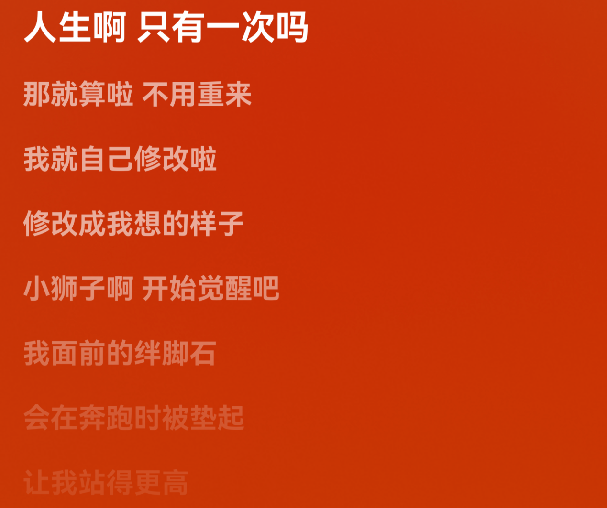
