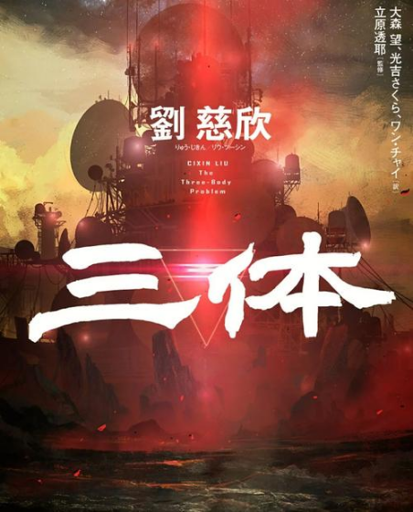
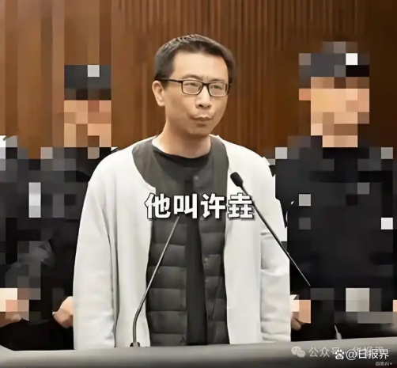
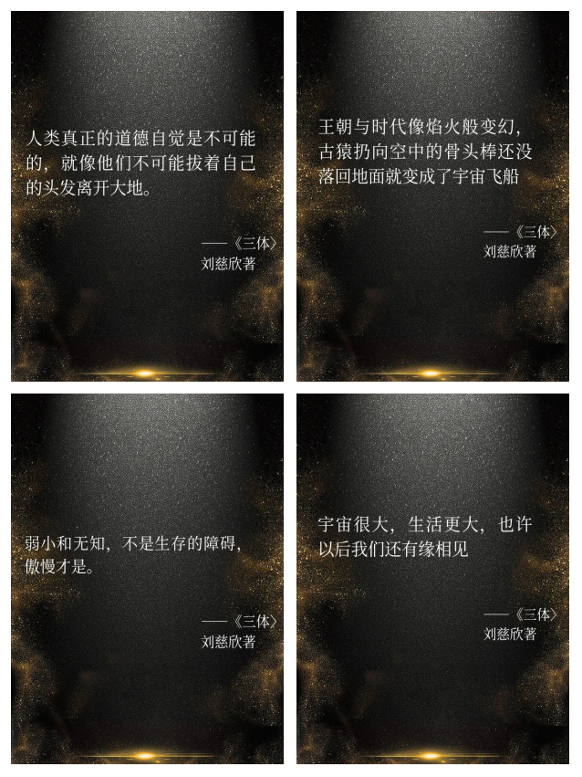
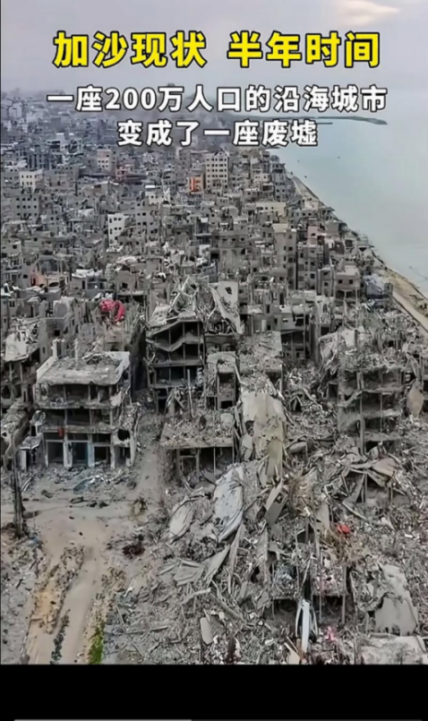
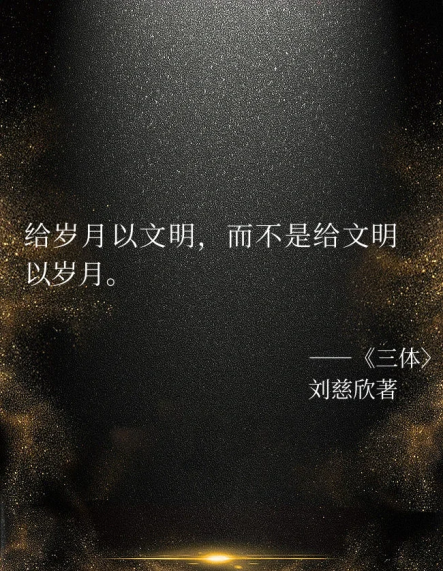

我们首次提出“百年未有之大变局”是在2017年末  
这8年来，过往的每一天，似乎都在用事实证明  
这一预判是正确的  
大变局是一种表述，也可称之为“乱纪元”  
“乱纪元”一词最早出自《三体》

今年发生了一件与《三体》有关的事情  
11月20日，上海市高级人民法院作出二审判决：  
驳回上诉，维持原判，被告人许垚被判处死刑  
此时，距离被称作“三体少主”的游族网络董事长林奇离世  
已然过去了五年

许垚，拥有美国密歇根大学法学博士学位  
处理过众多并购案例，专业能力十分出色  
2017年林奇经朋友介绍结识了许垚，二人一见如故  
林奇为许垚提供了高达2000万的年薪  
主要任务是为游族网络拿下《三体》改编权  
许垚于2018年以1.2亿元的价格成功搞定此事  
许垚是游族的大功臣了  
于是他开始想要股份，这就导致他和林奇有了矛盾  
2020年12月，许垚听说林奇想让他离职，于是决定报复  
12月16日林奇中毒，18日上海警方抓获许垚  
12月25日林奇去世，享年39岁  
许垚不仅不认罪，还拿出了早就准备好的精神病鉴定材料  
毕竟他是学法律的

审理过程很长也很艰难  
2024年3月上海市第一中级人民法院作出一审判决：  
许垚犯有故意杀人罪和投放危险物质罪，被判死刑  
许垚当庭上诉，认为证据链有漏洞  
直到2025年11月二审裁定：驳回上诉，维持原判  
许垚，罪有应得

《三体》中有个著名的“黑暗森林法则”：

宇宙就是一座黑暗森林，每个文明都是带枪的猎人  
人类社会发展至今，也有两条法则一直发挥重大作用：  
一是杀人偿命；二是欠债还钱

---

但如今，这两条法则在世界上的许多地方竟已失效  
即将过去的2025年里，我们看到  
一个个“黑暗森林”故事，正在上演

2025年的加沙，文明已荡然无存  
本轮冲突中，这片土地上已经有超过7万人死亡  
其中近一半是18岁以下的未成年人  
尽管国际社会不断呼吁停火  
但在彻底消灭对手的执念面前，一切都显得苍白无力

这一年来，俄乌战场上依旧硝烟弥漫  
曾经并肩的兄弟，如今却用战火无情地撕裂着  
这片他们曾经共同热爱的土地  
城市化为废墟  
士兵的生命如流星般转瞬即逝  
平民被迫背井离乡，生活陷入绝境  
根据最新的官方消息和各方表态  
目前俄乌谈判在核心政治和军事议题上仍未取得突破  
短期内不存在达成全面和平协议的可能性

赫拉利曾在他的《人类简史：从动物到上帝》中写到：  
“人类的欲望是推动社会进步的动力  
但也是导致冲突和危机的根源”  
我们并非要否定现代文明的价值  
但同时也必须明白，没有哪种秩序是永恒的  
毕竟智人的伟大不在于从不犯错  
而在于有能力反思自己的错误

