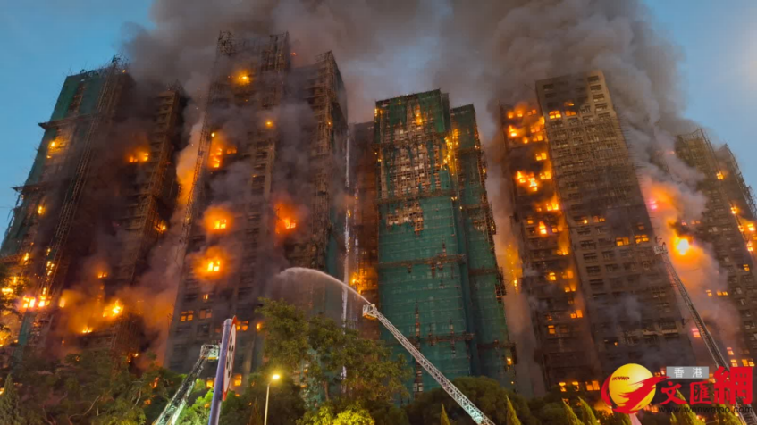
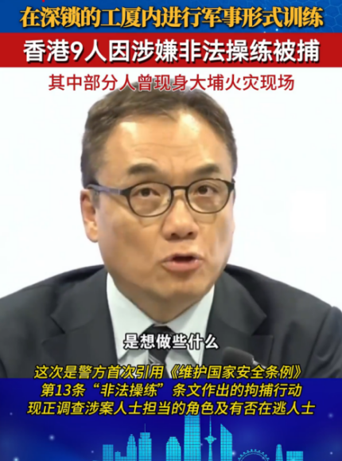
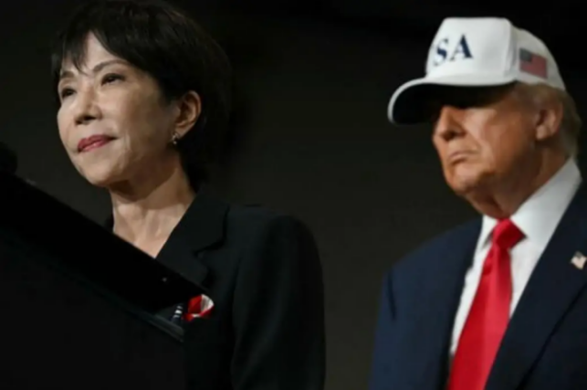
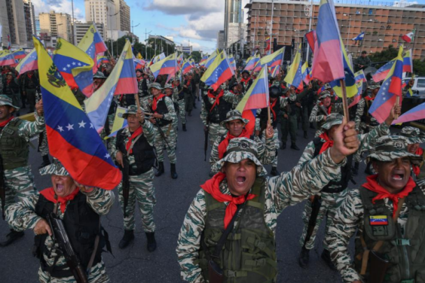
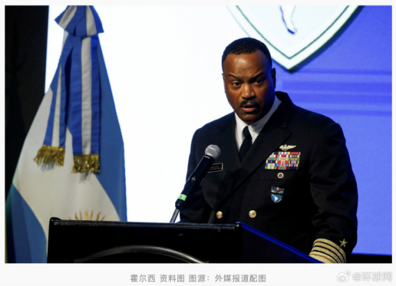
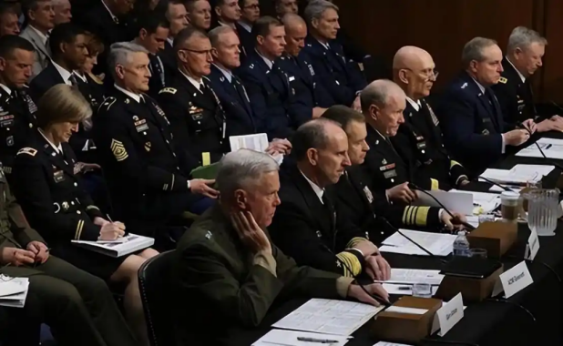
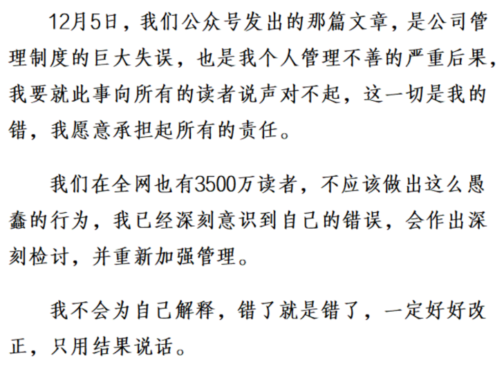
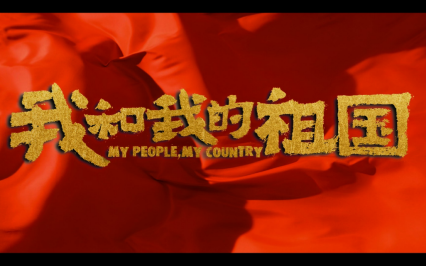

香港大埔火灾是令人惊悚的  
截至12月20日，遇难者增至161人

竹制脚手架和行业协会的事我们先姑且不说  
当深圳消防奔赴口岸，只等一声令下就可以投入救援时  
正如刘慈欣无论如何也想不到  
自己的《三体》会要了三体少主林奇的命  
我们也想不到任凭大火吞噬一条条生命  
特区政府却始终不提出支援申请  
深圳消防只能哀叹视之  
港人如此这般爱港，东方之珠怎还会有光芒？  
把本台在《守望（1）》中的一句话再次送给港府：  
“智人的伟大不在于从不犯错  
而在于有能力反思自己的错误。”

12月12日香港警务处召开记者发布会  
说这次火灾确有人为破坏的可能，我们继续关注吧！

---

想在中国周围煽风点火劲头最足的，当属高市早苗  
从11月7日将台湾问题与日本“存亡危机事态”挂钩至今  
始终没有任何认错的态度  
本台在之前的文章里已做了详细分析，其目的在于：  
引爆东亚  
绑架美国  
打断我们的台湾回归进程  
解除二战枷锁  
局势发展至今，本台当时提出的应对思路与走势一致

中国的邻居日本、菲律宾等惹是生非  
美国则把自己的邻居搞得痛不欲生  
懂王频繁抛出吞并加拿大使其成为美国第51州的言论  
让世界一片哗然

---

还有委内瑞拉  
懂王直接给委内瑞拉政府扣上了外国恐怖组织的帽子  
然后理直气壮地宣称要去收回本就属于美国的石油  
面对美国咄咄逼人的态势  
委内瑞拉政府一边向联合国痛斥这是21世纪的海盗行径  
一边也在焦急地观察着国际社会风向

---

12月12日美军南方司令部司令霍尔西提前2年突然卸任  
因为他和国防部长赫格塞思在如何对待委内瑞拉的问题上  
出现了根本性战略分歧  
懂王想打，但下面人反对  
再联系到今年九月份

全球各地的八百多名美军高级将领都接到命令  
限期赶回美国参加史无前例的军中紧急会议  
本台认为懂王并未做到掌控美军，目前他骑虎难下

12月17号王毅外长明确表态：  
中委是战略伙伴  
中国反对一切单边霸凌，支持各国捍卫自身主权和民族尊严  
再结合马杜罗和普京通话，中俄已经联手站在委内瑞拉背后  
虽然本台并不看好委未来走向  
但既然美国你做初一对台百亿军售  
那我做十五直捅你后花园的对等态度还是要有的

面对如此错综复杂的国际局势，可惜了卢克文  
一个很努力的爱国青年，没能控制住自己的愤怒  
关于对日作战的节目震动了千万粉丝  
但这偏离了国家既定策略，造成误导  
建议还是应该给他一个机会，毕竟没有任何叵测居心

萧伯纳曾说：  
“爱国主义者是一群有害的、精神错乱的白痴”  
因为他认为：  
“爱国主义就是让你确信  
这个国家比所有其他的国家都要好  
只因为你生在这里！”  
其实萧伯纳的这种认识是狭隘的：  
真正的爱国主义  
不是认为祖国比其他国家都要好  
而是知道自己的祖国不够好时，依然有信心有决心  
让祖国变得更好  
只因我，生在这里！

