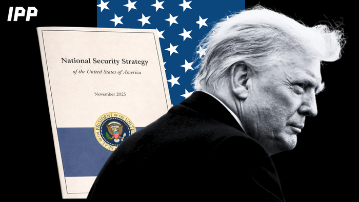
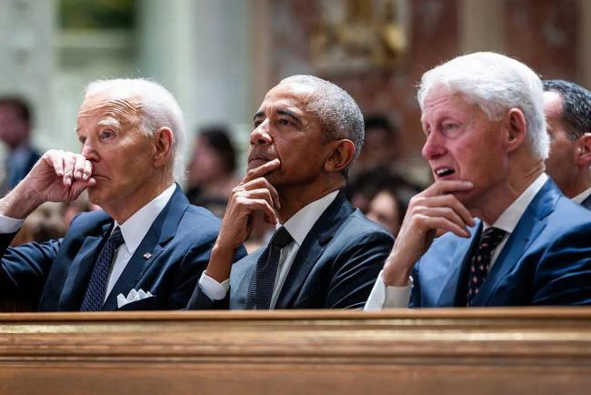
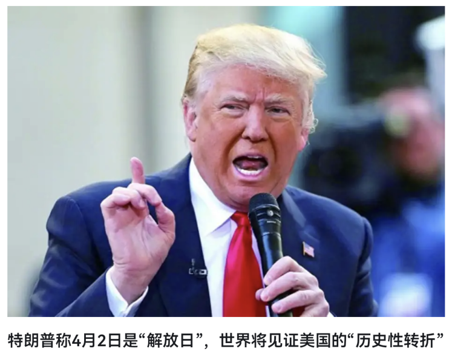
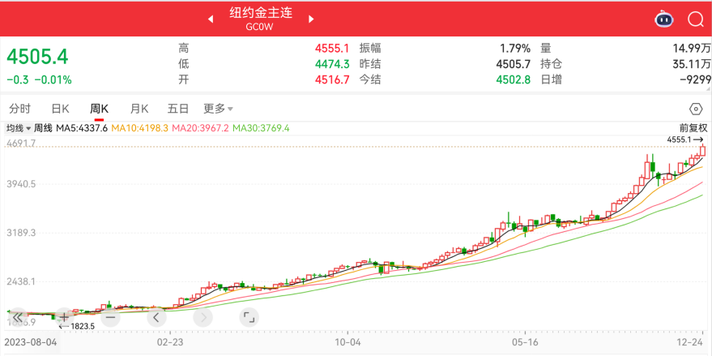
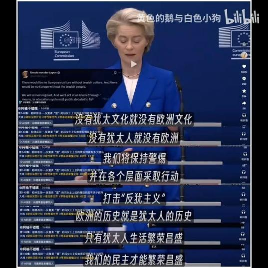
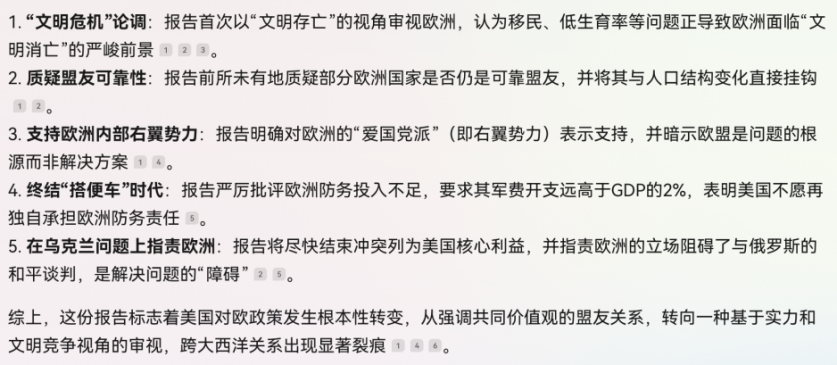
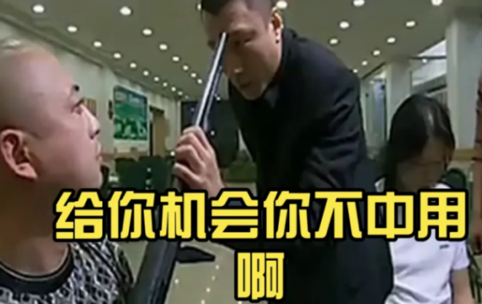
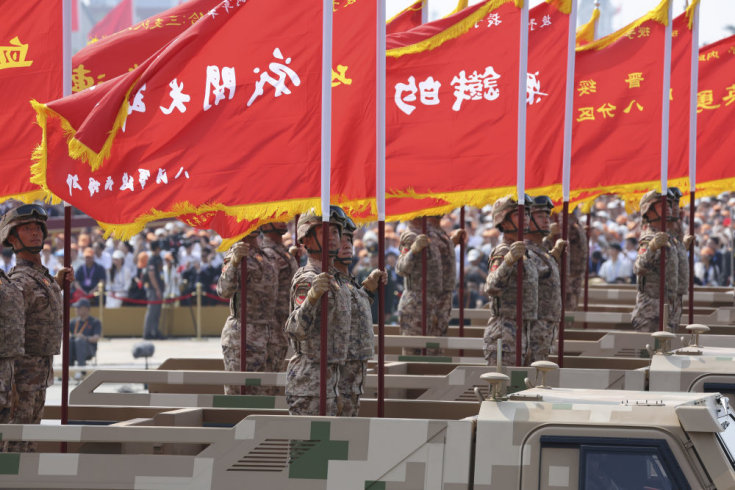
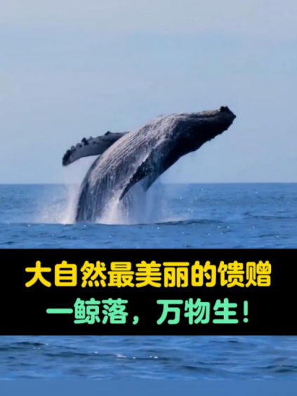

今天是圣诞节  
在外吃完饭后回来写今天的聊天体文章  
上一篇结束时谈到了爱国主义  
于是一个问题就出现在脑子里  
爱国主义和圣诞节是什么关系？  
本台的看法是：  
我们热爱自己的祖国和尊重西方文明并不矛盾  
我们尊重西方文明和否定西方政客也没什么冲突  
中华文明很了不起  
但西方文明对人类社会进步做出的贡献同样巨大  
想想我们的大学教科书  
现代文明尽在其中  
我们大学里设置的专业  
创立者也几乎都是西方大师  
当然，之所以这样，也是我们恰逢这个历史阶段  
看着中国几十年来的伟大成就  
我们不能妄自菲薄，但也不能盲目自大  
特别是当眼睁睁地看着现代文明步入“乱纪元”时代  
我们更希望通过一代代人的努力  
让中华文明成为未来人类文明的灯塔！

---

下面言归正传

12月4日美国发布的《国家安全战略》报告意义极其重大！  
这份报告的核心思想是：美国优先  
从之前强调全球主义  
转向以本土为中心、以利益为导向的战略布局

通过本台对美的持续分析并结合这份报告  
一个清晰的结论摆在眼前：  
因美国已经无力维持国际霸权，导致国际秩序面临深刻调整  
这就是我们解读近年全球大事件和“乱纪元”的思路主线

关于美国将会进行战略收缩  
本台早在懂王1.0时代就做出了明确判断  
当时得到这个判断是根据其发动贸易战做出的逻辑推演  
事实证明推演与事实相符，是正确的  
对比懂王1.0和2.0时代  
我们非常清楚地看到，美国的内斗再次升级  
简单认为其内斗还是两党之争，已经是错误的认识  
斗争主体已经变成两大利益集团：  
美国本土利益集团和国际资本利益集团  
懂王，本土利益集团代表  
拜登、奥巴马、克林顿，国际资本利益集团代表

大家还记得懂王把发动关税战的日子定义为解放日吗？  
他说美国在这一天结束了被剥削的时代

谁在剥削美国？他认为正是国际资本利益集团  
客观说，这种认识是有道理的  
经过多年发展，国际资本利益集团已经足够强大  
甚至可以说，目前全球政治和经济格局  
就是他们牵头建立起来的  
如果一切顺利，资本集团控制世界，那就没懂王什么事了  
但不顺利  
本台认为，不顺利的根本原因是两个：

原因一：资本贪得无厌的天性  
美债38万亿，还利息都费劲  
美股，历史高位  
一个英伟达，市值大到超出所有正常人的想象  
何况不止一个英伟达，而是七姐妹  
汇率，看美元指数，已经出现多次明显的背离  
黄金、白银等也都反应出美元价格远远偏离真实价值

其实远不止金融领域，资本的贪婪体现在很多方面  
今天不展开

原因二：没能控制中国  
1949年的中国已经奄奄一息  
建国后，在美苏两大巨头的夹缝中偷生  
改革开放，进入了资本集团控制的国际政治和经济体系中  
所以中国是这一体系的受益者，我们必须要客观承认  
也因此，中国多次说，要维护二战后形成的国际秩序

改开四十年，我们装傻充愣糊弄着  
总是让对方感觉即将被西化但又完全没有  
到现在，中国活过来了，还站起来了  
想控制中国，已经完全没有了这种可能性

当金融霸权和军事霸权都难以为继的时候  
资本集团的解决办法是什么？  
**_美元，是资本集团的财富载体  
美国，是资本集团的寄居地_**  
接下来一定还是美元吗？接下来一定还是美国吗？  
载体和寄居地，可不可以换个新的呢？  
这不是本台猜想，也不是资本集团现在才考虑的  
他们已经布局多年：  
第一，更换载体和寄居地  
资本，是没有感情和国界的  
他们选择的新的主要寄居地和载体是欧洲和欧元  
资本集团在欧洲的代言人，现在就是冯德莱恩

只有从这个角度看，才能真正理解  
这次《国家安全战略》报告中对欧洲的态度

还记得懂王1.0时期他就明确说过  
美国的敌人不是中俄，而是欧盟  
观众朋友可以查查原来的新闻，都有公开报道  
但现在的欧洲当真不给力啊  
一点都支楞不起来还当什么世界一级？

第二，控制中国，不行就兑子毁掉  
谁来完成这个任务？  
最合适的就是已经透支未来的美国和美军  
今年我们一反常态，频频亮相各种杀器  
特别是九三阅兵，让很多叫嚣的敌人彻底闭嘴

美国和美军愿意干这事吗？当然不愿意  
也就是在这种背景下  
懂王这个美国本土利益的代表及其草台班子再次登场

以上是本台对百年未有之大变局和“乱纪元”的根源分析  
这段历史进程中，没有人能独善其身

当巨鲸在深海中沉落  
那庞大的身躯倾覆，瞬间激起万丈波涛  
这并非都是死亡  
而是一场盛大的重生仪式  
海水翻涌  
万物在动荡中苏醒  
开启生命循环中的一个新篇章！

