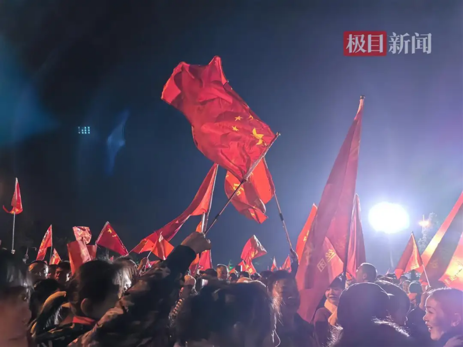
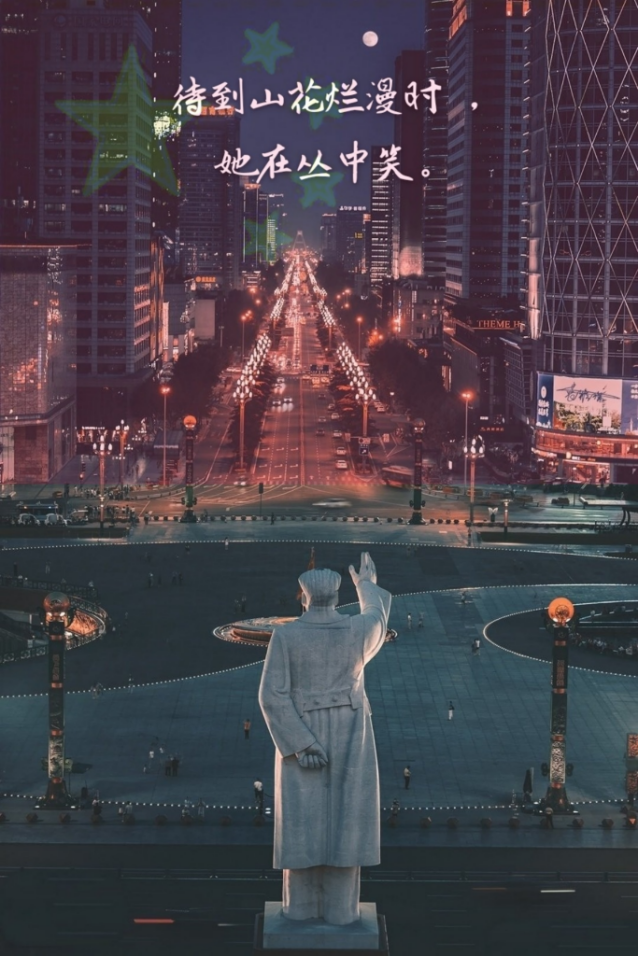
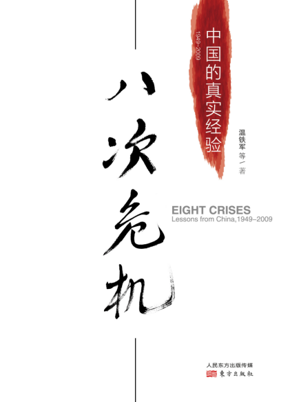
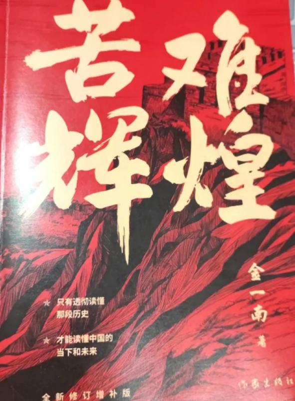
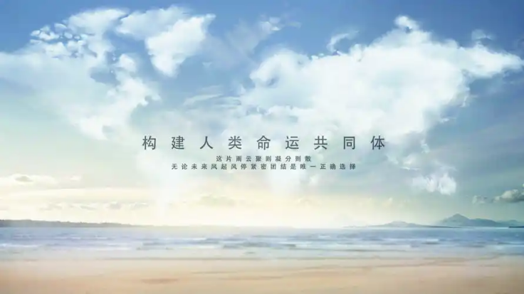
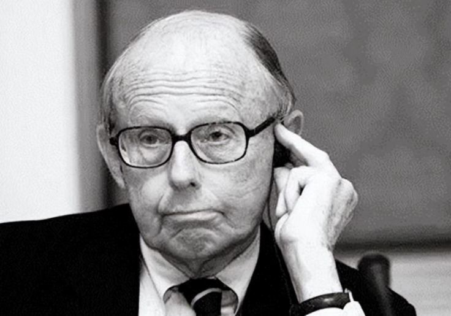
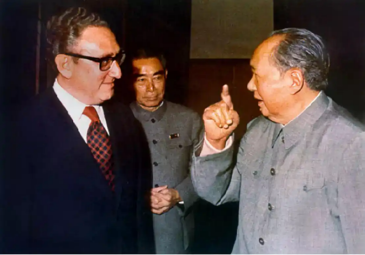
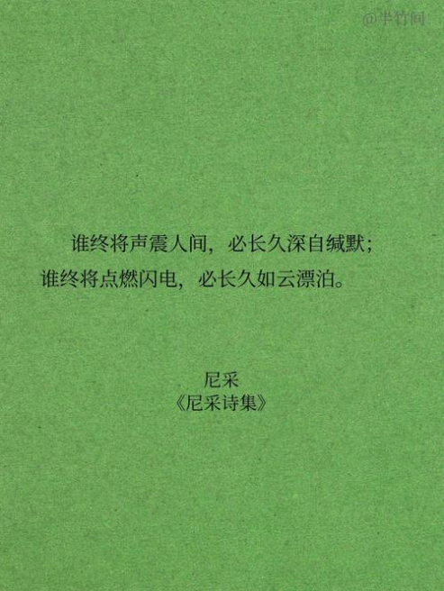
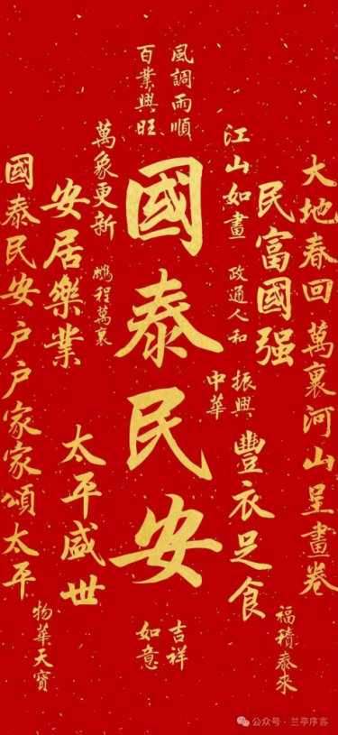

今天，12月26日，又到老人家生日  
数万人民群众来到韶山，自发缅怀

老人家曾说:  
不必时时怀念我  
也不要指望我回来  
我离开以后  
你们就是我  
人民万岁！

回顾从老人家时代走到新时代的这么多年  
所有人都应该知道:  
中华民族伟大复兴  
绝不是轻轻松松、敲锣打鼓就能实现的  
中国，是一个在近代百年屈辱沉沦的国家  
是一个后发的、背着巨大历史包袱的国家

---

我们能在百年之间奋而崛起  
除了有老人家等这样的伟人引领  
也离不开一代代人民的奉献付出  
为完成建国初期的工业化原始积累  
可亲可敬的中国农民  
做出巨大的牺牲与奉献  
推动了中国工业化渡过起步时最艰难的阶段

---

为了能有我们自己的原子弹  
全国人民勒紧裤腰带  
不惜一切代价才换来了罗布泊那一声巨响

为了能拥有保证国家安全的战略纵深  
抛洒美好年华只求付出不求回报的建设者  
奠定了那时的国防体系基础

为实现我们现代化原始积累  
全国无数家庭把几代人的积蓄投入房地产市场  
换来了我们全球第二大经济体的体量和  
独一无二的全产业链体系

因为苦难，所以辉煌  
这么多年  
有过彷徨  
有过不解  
有过愤怒  
有过寒心  
但本台相信  
我们正在经历的“乱纪元”时代  
是中华民族百年复兴中最关键的一个阶段  
是我们每个人都值得念念回首的终生记忆！

这不是一个最好的时代  
但这是一个最伟大的时代  
伟大在于，这不仅是民族的复兴  
更是在人类社会现代文明无路可走时  
中华文明将成为走出“乱纪元”的唯一选择

西方学者亨廷顿认为  
中国承袭至今的文明体系相当独特  
是四大古文明体系中唯一一个  
不曾断绝且将来仍然会延续下去的文明  
最重要的是，细看中华文明发展历程  
出现过不止一次可能导致文明灭亡的危机  
但这些危机总能在关键时刻被化解  
正因如此，亨廷顿才会说：  
中国是一个伪装成国家的文明  
并坚持认为中国早晚会回到世界的巅峰

基辛格谈论1820年后的中国时表示  
这近200年的时间不过是  
中华文明传承过程中的一个短暂意外  
中国随时都能找到一个开端  
并以此建立起一个大一统盛世  
周而复始，循环往复  
并且对于每一个大一统盛世  
中国人从不认为这是创造，都将其称为复兴

在英国学者马丁·雅克看来  
中华文明赋予了中国一种天然照顾他人的责任  
赋予了中国以历史维度展望国际的能力  
这种责任是西方文明完全不具备的  
西方国家往往都是如果不喜欢某个国家的情况  
先要求其按照自己的建议做事  
如果对方不从，就直接施压甚至是侵略

在加沙孩童惊恐的眼中  
在香港大火腾起的黑烟中  
在乌克兰和俄罗斯人民的哭泣中  
在委内瑞拉社会的集体恐惧中  
人类社会发展之路需要做出新的选择  
当毁灭的枪声在黑暗森林回荡  
中华文明需要成为指引人类的文明灯塔

眼下的我们  
同样也有很多困难  
但这个国家这个民族  
始终有黑暗森林中一盏盏不熄灭的希望之灯  
始终有国运征程中的不忘初心  
始终有复兴路上的与子同袍

这其中，应该有我们  
我们怎样，中国便怎么样  
我们追求光明，中国便不再黑暗  
我们守望  
守望民族复兴  
守望人类光明

见字如晤  
祝大家新年快乐！

